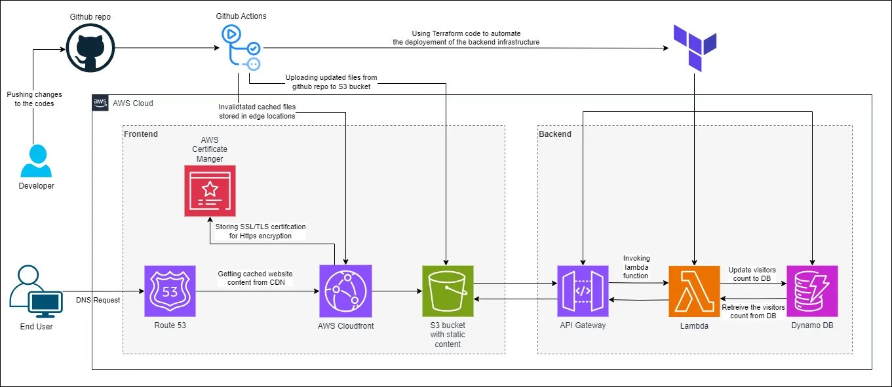

# 🏆 AWS Cloud Resume Challenge - [aaronke.com](https://aaronke.com)

## 📌 Overview
This project is my implementation of the **AWS Cloud Resume Challenge**, demonstrating a **full-stack serverless application** hosted on AWS. It showcases my ability to work with **cloud technologies, CI/CD automation, and infrastructure as code**.

The website is live at **[aaronke.com](https://aaronke.com)**.

---

## 🛠️ Technologies Used

### **Frontend (Static Website)**
- 🗂 **S3** – Hosts the static files (HTML, CSS, JavaScript).
- 🚀 **CloudFront** – Serves the website via a global CDN for performance and security.
- 🌍 **Route 53** – Manages the custom domain (**aaronke.com**).
- 🔒 **AWS Certificate Manager (ACM)** – Provides SSL/TLS certificates for HTTPS encryption.

### **Backend (Serverless)**
- 🏗 **Lambda** – Serverless function that updates and retrieves visitor count from DynamoDB.
- 💾 **DynamoDB** – NoSQL database used to store and track website visits.

### **CI/CD & Infrastructure as Code**
- 🤖 **GitHub Actions** – Automates deployment by pushing website updates to S3 and invalidating the CloudFront cache.
- ⚙️ **Terraform** – Defines and provisions the cloud infrastructure as code.

---

## 📌 How It Works

### 1️⃣ **Frontend Flow**
1. **End User** visits **[aaronke.com](https://aaronke.com)**.
2. A **DNS request** is sent via **Route 53**, which resolves to a CloudFront distribution.
3. **CloudFront** caches and serves the static content stored in an **S3 bucket**.
4. The website loads, and a JavaScript function calls **AWS Lambda directly** to update and display the visitor count.

### 2️⃣ **Backend Flow (Without API Gateway)**
1. The website triggers an **AWS Lambda** function directly via the **AWS SDK** in JavaScript.
2. The Lambda function:
   - Retrieves the visitor count from **DynamoDB**.
   - Increments the count and updates it in **DynamoDB**.
3. The updated count is returned and displayed on the website.

### 3️⃣ **CI/CD Deployment**
- **Frontend Updates**: Any push to the GitHub repository triggers **GitHub Actions**, which:
  - Uploads files to **S3**.
  - Invalidates the **CloudFront** cache to reflect changes.
- **Backend Updates**: Terraform is used to provision and manage AWS resources.

---

## 📝 Disclaimer  
The architecture diagram includes **API Gateway**, but in my actual implementation, I did **not** use API Gateway to invoke the Lambda function. Instead, I granted my **Lambda function an IAM role** with **direct permissions** to read from and write to **DynamoDB**. This approach was chosen for **cost efficiency** and **simplicity**, as API Gateway was not required for this specific use case. The frontend calls the Lambda function directly using the **AWS SDK**.

---
